# Installation

Computer needs Python 3 installed

## pySerial

* https://pythonhosted.org/pyserial/index.html

## pyFTDI

Uses the FTDI Python library package, PyFTDI:

* https://pypi.org/project/pyftdi/
* https://eblot.github.io/pyftdi/index.html

As mentioned in the [installation documentation](https://eblot.github.io/pyftdi/installation.html), 
pyFTDI requires `libusb 1.x`. Installing this on Windows can be tricky.
We used the Zadig method described in the instructions with success.

## Python libraries

These python libraries should be installed

```bash
$ pip install pyserial pyftdi
```

## Program 

To open the port using the FTDI library, you need to know the URL name
of the device connected to your system ( see [here])https://eblot.github.io/pyftdi/urlscheme.html) ).
If you just run the program with the `list` option, all available FTDI
devices will be shown:

```bash
$ python kt2reader.py list
Available interfaces:
  ftdi://ftdi:232h:1/1
```

Put this URL in the source code `kt2reader.py`.

Run the program as follows:

```bash
$ python kt2reader.py help
Usage:
kt2reader [help|list|nframes]
Where:
      help   this help message
      list   show available FTDI serial port URLs
   nframes   how many frames to capture, integer, def=1
Output:
   goes to stdout, can be redirected, for example:
      kt2reader 10 > capture.txt
Data fields:
      time   relative time in seconds
    frame#   sequential frame number
      size   size of buffer, should be 646
      sync   sync pattern 0x5a a5 5a a5
      row#   row number, 0 to 79
      type   image type, 0=dist cm

$ python kt2reader.py 4 > capture.txt

```

## Notes 16 Feb 2021

#### About image drawing

Method using opencv-python is shown in program `kt2reader_rev1.py` 
I am not too familiar with opencv in Python. But I had already been
experimenting with using matplotlib to draw images (just from an 
[online example I found](https://stackoverflow.com/questions/17835302/how-to-update-matplotlibs-imshow-window-interactively).

Take a look at this version using matplotlib: `kt2reader_rev2.py`
It might be working, I can't tell 100% because of some network
connection issues.

Also I am testing making a generator `get_frame()` function which yields
between frames. Not sure if this would help or not. 
Not 100% ready yet, but shows the concept: `kt2reader_generator.py`

Note: Using Python 3.7.5 on this Windows computer for testing.
Other versions could be installed if needed to match a different setup.

#### Screen capture examples:

Made with `kt2reader_rev2.py`

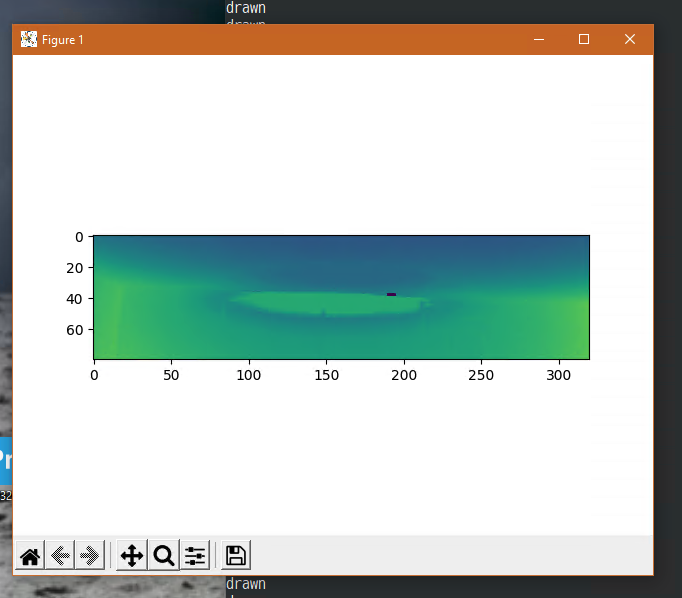
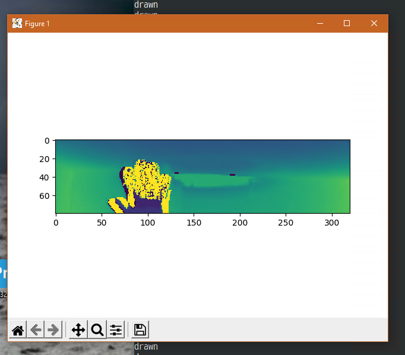

## Notes 19 Apr 2021: Times and Speed Calculations

* UART running 12 Mbaud == 83.333 nsec
* each byte 10 bits: 833.333 nsec <==> 1.2 Mbytes/sec
* one video line is 646 bytes: 538.333 usec <==> 1.858 K-lines/sec
* one video frame: 
  - 80 lines: 51,680 bytes = 50.469 Kibytes
  - 80 lines: 43.067 msec <==> 23.219 frames/sec max

The captured data file can be viewed in an editor or plotted using
`plotcap.py`:

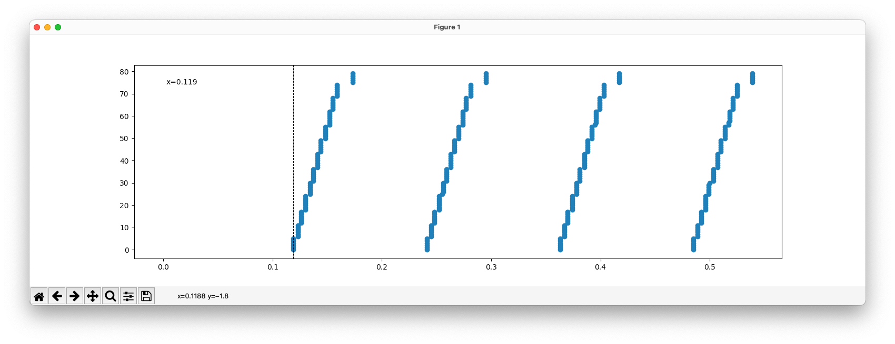
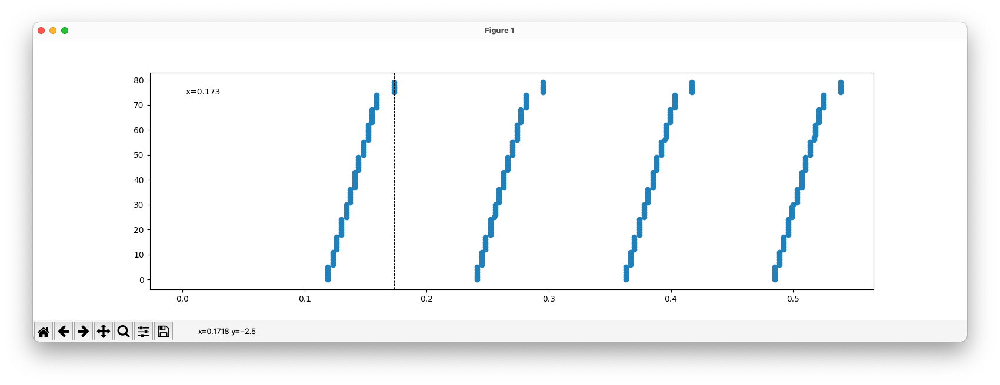
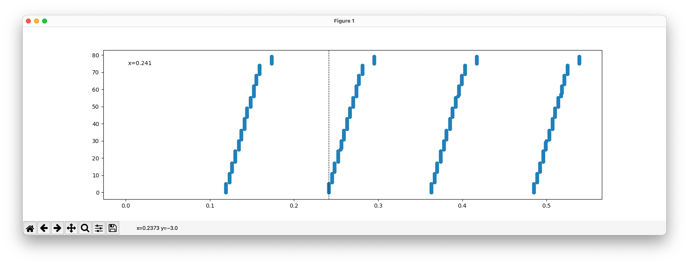

We see about 6 lines of data being read almost simultaneously
This suggests the buffer size of the UART... let's check it:

* FTDI FT232H has 2K buffer

* One frame takes about 60ms to send 
  - 750 usec / line
  - 212 usec gap between lines
* Frame period: about 118.5 ms  <==> 8.44 FPS
  - about 60 msec gap between frames
  - could this be an entire missing frame?

## Testbed

Simple program written to generate test pattern (actually any image
file) and send it from STM32F4 microcontroller.

For example, using Hybo logo file, resize it to 320x80 and make 16-bit
grayscale using `imagemagick`:

```bash
$ convert hybo-logo.png -resize 320x80 hybo-logo-320x80.png
$ convert hybo-logo.png -resize 320x80 -depth 16 -type Grayscale -negate hybo-logo-320x80.png
```

Using a few lines of Python (see `make-array.py`) to generate an array
of pixel data suitable for including in the microprocessor code as 
constant image data (see the resulting file `logo.c`). Programmed this
into an iLidar unit (it was convenient and nearby), used comms from the
User I/O pins through an external FT232H USB-to-serial adaptor to
simulate a KT2 unit.

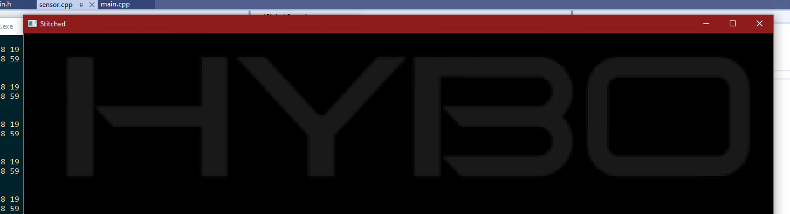
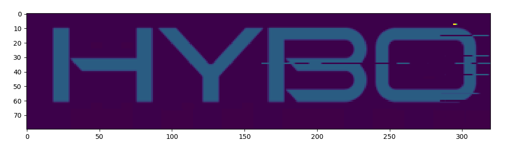

Was able to match the timing of the real sensor reasonably well. 
This gives a portable and known pattern to be used for serlial link testing.

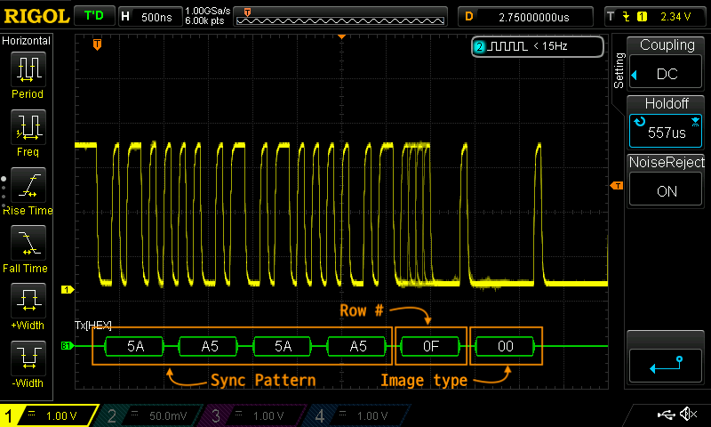

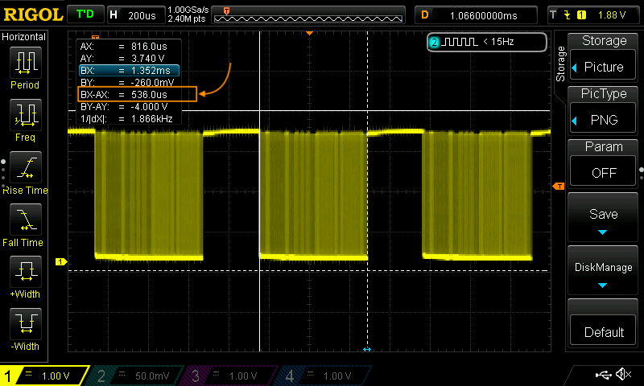


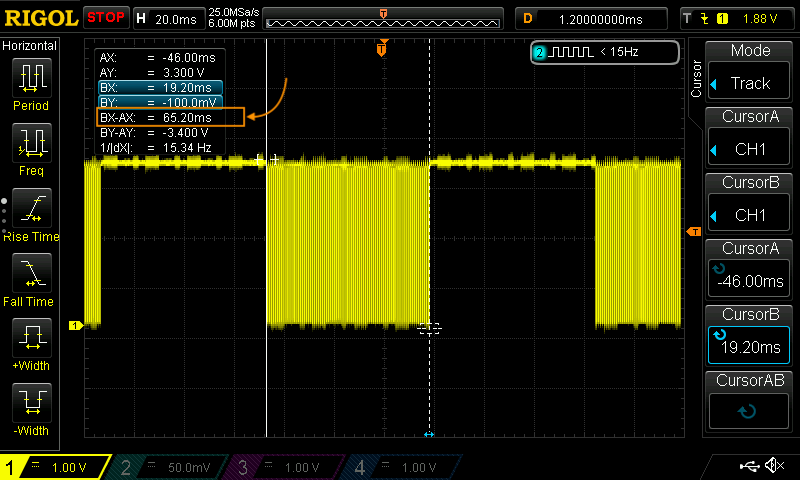

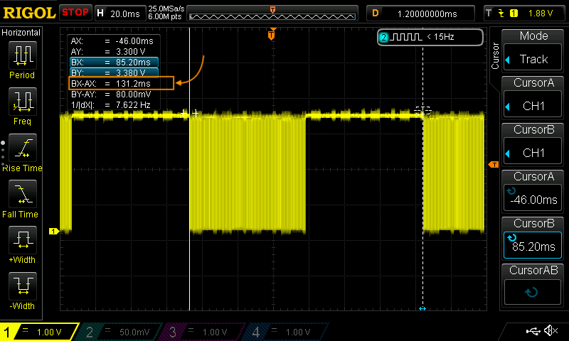

## Notes 22 Apr 2021: More Refactoring for Time

Transfered development onto Ubuntu 20.04 machine.
Implemented reading from the serial port in a separate Python thread.
Cleaned up some of the code to make it more efficient.
Results are promising. 
Will continue working on some tweaks to the circular buffer reading
parameters. 
On Ubuntu and Windows machine, the time consumed by the plotting routine
can be quite signicifant. 

Here are some statistics (in seconds) for time spend parsing (once per line)
and time spend drawing the plot (once per frame). Parsing time looks
okay.

```
Tparse,  mean: 0.000022
Tparse, stdev: 0.000144
Tparse,   max: 0.000000
Tparse,   min: 0.001047

T.plot,  mean: 0.038009
T.plot, stdev: 0.013087
T.plot,   max: 0.023807
T.plot,   min: 0.133878
Threaded ringbuf reader has ended
```

The plotting average time of 38 msec could be an issue...
we're trying to receive on the order of one video line per millisecond
This success of this depends on how Python implements multitasking.
The time to plot can peak at over 130 milliseconds, which is an entire
video frame (plus gap between frames) in this existing demo hardware.

Try `kt2reader_rev6.py` to see this result

Added reading of FTDI serial port URL from a text file.
When you use the `list` option to see the connected FTDI urls, 
it saves it in a text file having the hostname of your computer.
When starting the program, it reads the first one it finds in that file.
(If there are multiple such FTDI ports on your computer, delete the ones
you don't want from the file).


## Notes 26 April Week, Socket server/client approach

Did some more testing, implemented the serial receiver as a completely
separate process, communicating with the main processing program over a
TCP socket. This code is in `kt2server.py` and `kt2client.py`. In this
first attempt, I was doing the packet synchronization in the server
portion (the code which also was reading the sensor). This approach did
not seem to perform any better than earlier ones.

Next, I moved the packet syncing code to the client, so the server did
as little processing as possible. This is found in `kt2server_rev2.py` 
and `kt2client_rev2.py`. In this case, also, the performance was not
much better.

## Notes 3 May 2021

Decided to look at the timing of just displaying the data -- forget
entirely about reading data from the sensor. I made a minimal playback
loop that displayed images which were already prepared and stored in
memory. This code is found in `kt2player.py`.

The results of this show that (on my machine) we sometimes see single
frame plots taking well over 140 ms. Here are the results of
a run I made, drawing images 1000 times and calculating the statistics
of the time it took to plot each image. I made two sets of numbers,
because of the wild point at over 140 msec. The second set of statistics
is with clipping the data at 100 milliseconds.

#### Statistics of Display Drawing Times (milliseconds)

```
T.plot,   num: 1000
T.plot,  mean: 21.052827
T.plot, stdev: 4.223990
T.plot,   min: 19.234180
T.plot,   max: 148.691654
```

```
T.clip,   num: 999
T.clip,  mean: 20.925060
T.clip, stdev: 1.232604
T.clip,   min: 19.234180
T.clip,   max: 42.851686
```

After looking at this data more, I realized there was only one data
point clipped, and that was the first one. I assume that either or both
of these functions must perform extra setup code the first time they are called.

```python
  axim1.set_data(depth_img_array)
  fig1.canvas.flush_events()
```

#### Machine Details

Maybe your project will be running on much faster hardware than I am
using? For reference, summary of my Ubuntu machine is as follows:

* Intel NUC8i3BEH
* Intel(R) Core(TM) i3-8109U CPU @ 3.00GHz
* Iris Plus Graphics 655
* 8GiB RAM
* 256GB NVMe SSD

